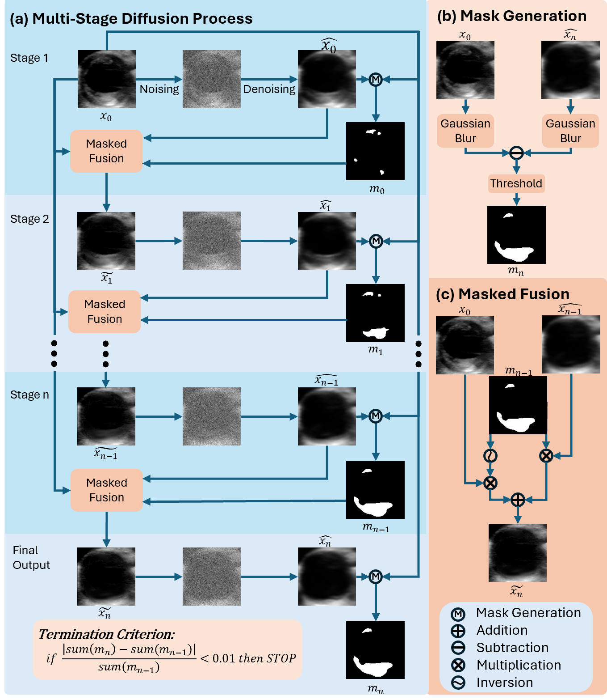

## Synomaly Noise and Multi-Stage Diffusion: A Novel Approach for Unsupervised Anomaly Detection in Medical Images

Anomaly detection in medical imaging plays a crucial role in identifying pathological regions across various imaging modalities, such as brain MRI, liver CT, and carotid ultrasound (US). However, training fully supervised segmentation models is often hindered by the scarcity of expert annotations and the complexity of diverse anatomical structures. To address these issues, we propose a novel unsupervised anomaly detection framework based on a diffusion model that incorporates a synthetic anomaly (Synomaly) noise function and a multi-stage diffusion process. Synomaly noise introduces synthetic anomalies into healthy images during training, allowing the model to effectively learn anomaly removal. The multi-stage diffusion process is introduced to progressively denoise images, preserving fine details while improving the quality of anomaly-free reconstructions. The generated high-fidelity counterfactual healthy images can further enhance the interpretability of the segmentation models, as well as provide a reliable baseline for evaluating the extent of anomalies and supporting clinical decision-making. Notably, the unsupervised anomaly detection model is trained purely on healthy images, eliminating the need for anomalous training samples and pixel-level annotations.

### Dataset
We evaluate on three benchmark datasets:
- **BraTS 2023** (Brain MRI)
- **LiTS** (Liver CT)
- **In-house Carotid Plaque US** dataset

### Features
- Purely **unsupervised** training using only healthy samples
- Customizable **Synomaly Noise** generation
- **Multi-stage Diffusion** denoising for better detail preservation

<b>Fig. 1:</b> Overview of the proposed approach.(a) illustrates the training process of the proposed unsupervised anomaly detection approach, where Synomaly noise is utilized to corrupt the healthy image. (b) depicts the inference processs, in which Gaussian noise is applied directly to the anomalous images. Since the trained model has already been exposed to similar synthetic anomalies during training, it can efficiently erase the abnormalities. Multi-stage diffusion process is implemented to conserve fine details of the original image, thus increasing the anomaly detection accuracy.

<b>Fig. 2:</b> Multi-stage diffusion process with masked fusion.

<b>Fig. 3:</b> Samples of anomaly segmentation results using different unsupervised methods.

<b>Fig. 4:</b> Visual comparison between images generated using multi-stage diffusion process and single-stage diffusion process with DDPM trained using Synomaly noise. The images are arranged in the order of input image, noised image, and denoised image. (a), (b), (c), and (d) depict images generated at each stage of the multi-stage diffusion process. (e), (f), (g), and (h) represent the corresponding images generated using the single-stage diffusion process.

### Models
The trained models can be accessed via this link: https://drive.google.com/file/d/1Bx6fEKPalRhh4vcL9kMEj4ntfkRZdMNT/view?usp=sharing
